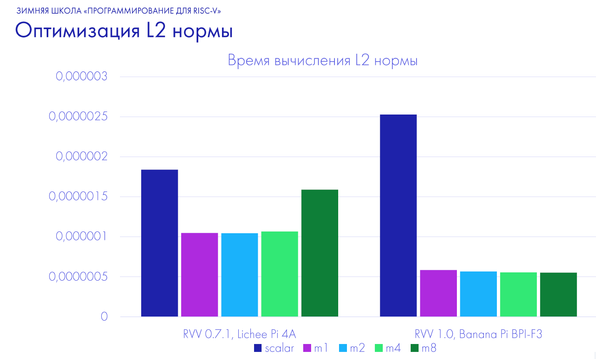
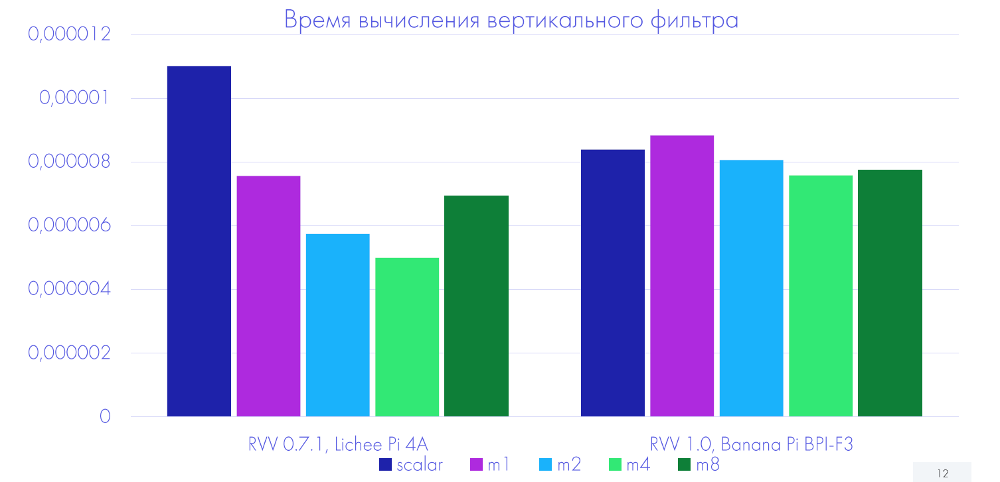

# Выбор LMUL в алгоритмах с использованием RVV

## Обзор проекта
Данный проект представляет собой учебную реализацию, созданную в рамках Зимней Школы «Программирование для RISC-V» от YADRO. Основная цель проекта — оптимизация работы с параметром LMUL в алгоритмах с использованием расширений RVV.

## Реализованные алгоритмы
В проекте реализованы два алгоритма, оптимизированных с использованием RVV интринсиков:
- **L2 норма**: вычисление L2 нормы векторов.
- **Ядро Гаусса**: фильтр Гаусса с вертикальным и горизонтальным проходом.

## Инфраструктура проекта
Реализована инфраструктура, которая:
- Автоматически собирает проект.
- Выбирает необходимые интринсики для RVV 0.7.1 или RVV 1.0.
- Рекомендует оптимальное значение LMUL для конкретной программы.

## Структура проекта
- **src/** – исходный код алгоритмов и логики оптимизации.
- **cmake/** – файлы CMake для сборки проекта.
- **toolchains/** – конфигурации для различных инструментов сборки.
- **images/** – изображения, иллюстрирующие результаты работы и архитектуру проекта.


## L2 норма
Результаты векторизации L2 нормы:


## Ядро Гаусса
Алгоритмическая оптизация фильтра гаусса - вертикальное и горизонтальное разбиение: 

Результаты замеров производительности скалярной алгоритмически оптимизированной версии с векторизованной алгоритмически оптимизированной.
 
 
Сравнение результатов выбора LMUL программой и фактически оптимальным LMUL:
 

## Сборка и запуск
Для сборки проекта выполните:
```bash
bash build_all.sh
```
Для запуска тестирования и демонстрации работы алгоритмов:
```
python run_all.py
```
## Итоги работы
Была подготовлена инфраструктура для автоматического подбора оптимального параметра LMUL.

Реализованы оптимизированные версии для алгоритмов L2 нормы и фильтра Гаусса с использованием интринсиков.

Были получены результаты времени работы L2 нормы и фильтра Гаусса в зависимости от параметра LMUL. (Тестирование проводилось на двух доступных платформах)

Реализована версия фильтра Гаусса с оптимальным значением параметра, достигнуто ускорение 2.5 раза для Banana Pi BPI-F3 и в 1.7 раза для Lichee Pi 4A

